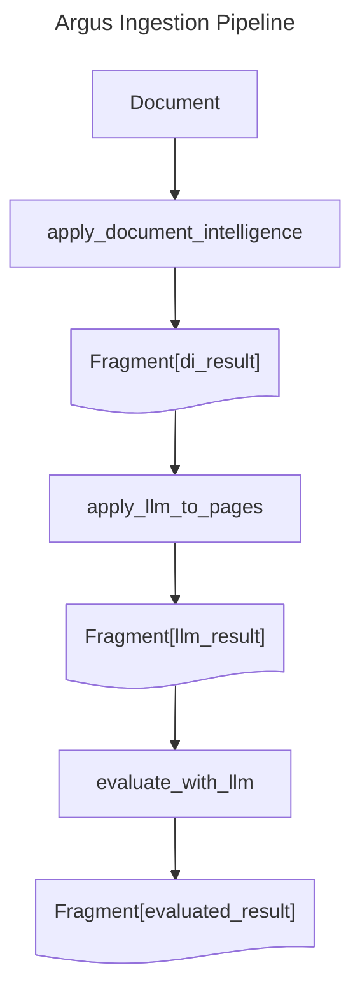

```mermaid
---
title: Argus Ingestion Pipeline
---
flowchart TD
    Fragment_llm_result@{ shape: doc, label: "Fragment[llm_result]" }
    Fragment_di_result@{ shape: doc, label: "Fragment[di_result]" }
    Fragment_evaluated_result@{ shape: doc, label: "Fragment[evaluated_result]" }
    apply_document_intelligence@{ shape: rect, label: "apply_document_intelligence" }
    apply_document_intelligence --> Fragment_di_result
    Document --> apply_document_intelligence
    apply_llm_to_pages@{ shape: rect, label: "apply_llm_to_pages" }
    apply_llm_to_pages --> Fragment_llm_result
    Fragment_di_result --> apply_llm_to_pages
    evaluate_with_llm@{ shape: rect, label: "evaluate_with_llm" }
    evaluate_with_llm --> Fragment_evaluated_result
    Fragment_llm_result --> evaluate_with_llm

```