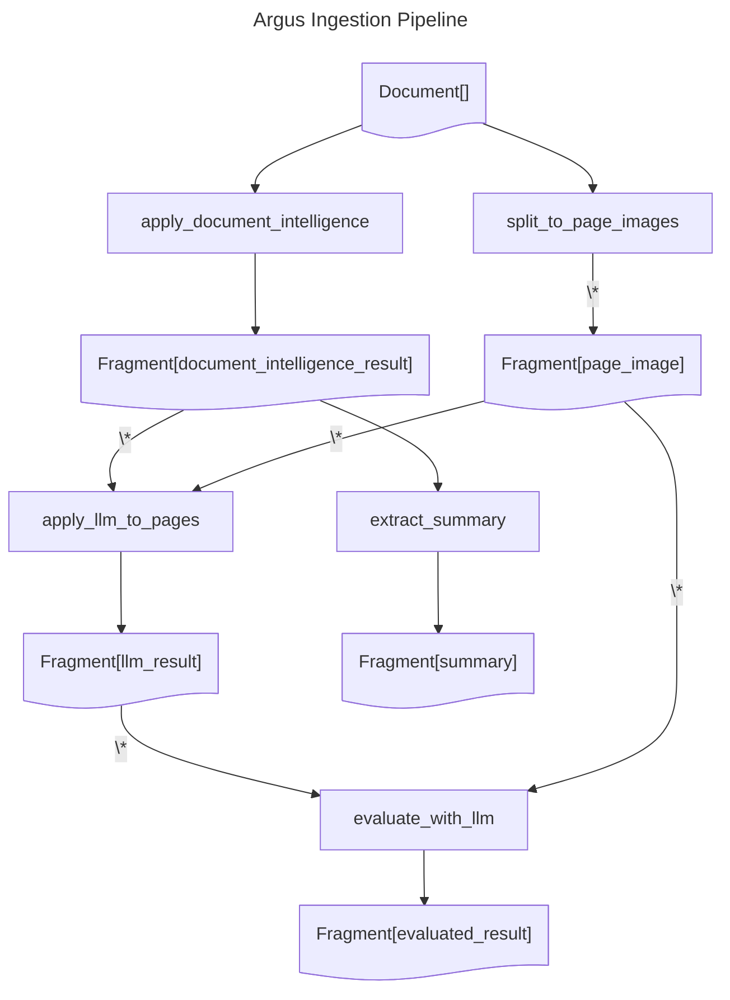

```mermaid
---
title: Argus Ingestion Pipeline
---
flowchart TD
    evaluate_with_llm@{ shape: rect, label: "evaluate_with_llm" }
    Fragment_llm_result@{ shape: doc, label: "Fragment[llm_result]" }
    apply_document_intelligence@{ shape: rect, label: "apply_document_intelligence" }
    Fragment_evaluated_result@{ shape: doc, label: "Fragment[evaluated_result]" }
    Fragment_page_image@{ shape: doc, label: "Fragment[page_image]" }
    apply_llm_to_pages@{ shape: rect, label: "apply_llm_to_pages" }
    Fragment_summary@{ shape: doc, label: "Fragment[summary]" }
    extract_summary@{ shape: rect, label: "extract_summary" }
    Fragment_document_intelligence_result@{ shape: doc, label: "Fragment[document_intelligence_result]" }
    Document_@{ shape: doc, label: "Document[]" }
    split_to_page_images@{ shape: rect, label: "split_to_page_images" }
    Document_ --> apply_document_intelligence
    apply_document_intelligence --> Fragment_document_intelligence_result
    Document_ --> split_to_page_images
    split_to_page_images -- \* --> Fragment_page_image
    Fragment_document_intelligence_result -- \* --> apply_llm_to_pages
    Fragment_page_image -- \* --> apply_llm_to_pages
    apply_llm_to_pages --> Fragment_llm_result
    Fragment_document_intelligence_result --> extract_summary
    extract_summary --> Fragment_summary
    Fragment_llm_result -- \* --> evaluate_with_llm
    Fragment_page_image -- \* --> evaluate_with_llm
    evaluate_with_llm --> Fragment_evaluated_result
```