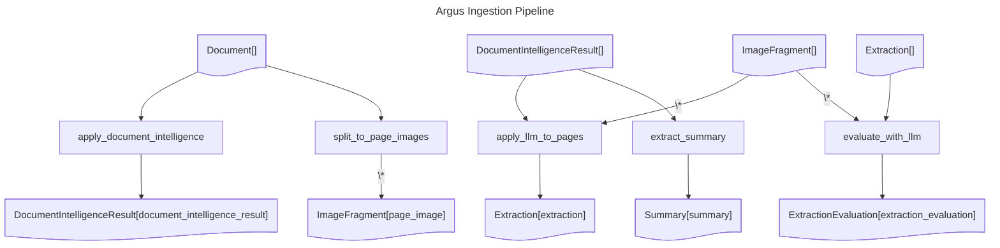

```mermaid
---
title: Argus Ingestion Pipeline
---
flowchart TD
    Document_@{ shape: doc, label: "Document[]" }
    DocumentIntelligenceResult_document_intelligence_result@{ shape: doc, label: "DocumentIntelligenceResult[document_intelligence_result]" }
    apply_document_intelligence@{ shape: rect, label: "apply_document_intelligence" }
    ImageFragment_page_image@{ shape: doc, label: "ImageFragment[page_image]" }
    split_to_page_images@{ shape: rect, label: "split_to_page_images" }
    DocumentIntelligenceResult_@{ shape: doc, label: "DocumentIntelligenceResult[]" }
    ImageFragment_@{ shape: doc, label: "ImageFragment[]" }
    Extraction_extraction@{ shape: doc, label: "Extraction[extraction]" }
    apply_llm_to_pages@{ shape: rect, label: "apply_llm_to_pages" }
    Summary_summary@{ shape: doc, label: "Summary[summary]" }
    extract_summary@{ shape: rect, label: "extract_summary" }
    Extraction_@{ shape: doc, label: "Extraction[]" }
    ExtractionEvaluation_extraction_evaluation@{ shape: doc, label: "ExtractionEvaluation[extraction_evaluation]" }
    evaluate_with_llm@{ shape: rect, label: "evaluate_with_llm" }
    Document_ --> apply_document_intelligence
    apply_document_intelligence --> DocumentIntelligenceResult_document_intelligence_result
    Document_ --> split_to_page_images
    split_to_page_images -- \* --> ImageFragment_page_image
    DocumentIntelligenceResult_ --> apply_llm_to_pages
    ImageFragment_ -- \* --> apply_llm_to_pages
    apply_llm_to_pages --> Extraction_extraction
    DocumentIntelligenceResult_ --> extract_summary
    extract_summary --> Summary_summary
    Extraction_ --> evaluate_with_llm
    ImageFragment_ -- \* --> evaluate_with_llm
    evaluate_with_llm --> ExtractionEvaluation_extraction_evaluation
```