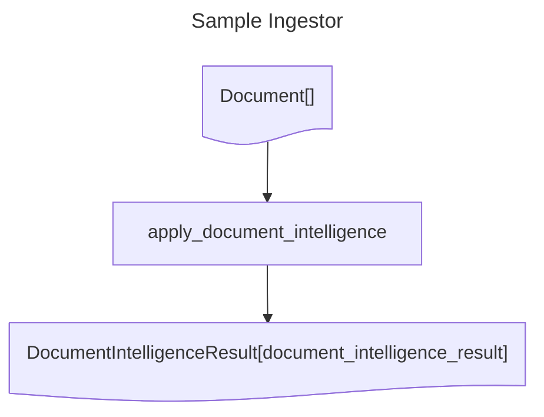

# Sample Ingestor
## Diagram

## Operations documentation
### apply_document_intelligence


Apply Document Intelligence to the document and return a fragment with the result.
<details>
<summary>Code</summary>

```python
@catalyst.operation()
def apply_document_intelligence(
    document: Document,
) -> Annotated[DocumentIntelligenceResult, "document_intelligence_result"]:
    """
    Apply Document Intelligence to the document and return a fragment with the result.
    """
    poller = catalyst.document_intelligence_client.begin_analyze_document(
        model_id="prebuilt-layout",
        body=AnalyzeDocumentRequest(
            bytes_source=document.content,
        ),
        features=[
            DocumentAnalysisFeature.OCR_HIGH_RESOLUTION,
        ],
        output_content_format=DocumentContentFormat.Markdown,
    )
    return DocumentIntelligenceResult.with_source_result(
        document,
        label="document_intelligence_result",
        analyze_result=poller.result(),
    )

```

</details>
