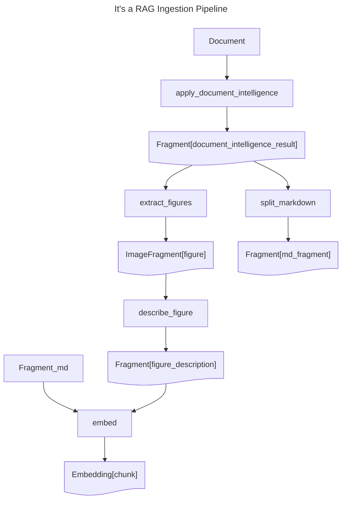

```mermaid
---
title: It's a RAG Ingestion Pipeline
---
flowchart TD
    Fragment_figure_description@{ shape: doc, label: "Fragment[figure_description]" }
    Embedding_chunk@{ shape: doc, label: "Embedding[chunk]" }
    ImageFragment_figure@{ shape: doc, label: "ImageFragment[figure]" }
    Fragment_document_intelligence_result@{ shape: doc, label: "Fragment[document_intelligence_result]" }
    Fragment_md_fragment@{ shape: doc, label: "Fragment[md_fragment]" }
    apply_document_intelligence@{ shape: rect, label: "apply_document_intelligence" }
    apply_document_intelligence --> Fragment_document_intelligence_result
    Document --> apply_document_intelligence
    extract_figures@{ shape: rect, label: "extract_figures" }
    extract_figures --> ImageFragment_figure
    Fragment_document_intelligence_result --> extract_figures
    describe_figure@{ shape: rect, label: "describe_figure" }
    describe_figure --> Fragment_figure_description
    ImageFragment_figure --> describe_figure
    split_markdown@{ shape: rect, label: "split_markdown" }
    split_markdown --> Fragment_md_fragment
    Fragment_document_intelligence_result --> split_markdown
    embed@{ shape: rect, label: "embed" }
    embed --> Embedding_chunk
    Fragment_md --> embed
    Fragment_figure_description --> embed

```