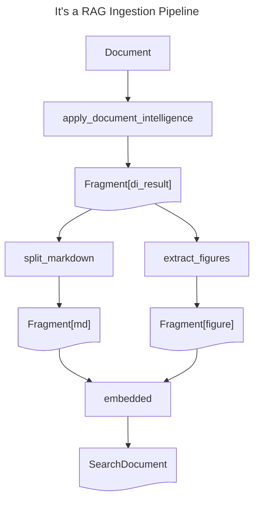

```mermaid
---
title: It's a RAG Ingestion Pipeline
---
flowchart TD
    SearchDocument@{ shape: doc, label: "SearchDocument" }
    Fragment_md@{ shape: doc, label: "Fragment[md]" }
    Fragment_figure@{ shape: doc, label: "Fragment[figure]" }
    Fragment_di_result@{ shape: doc, label: "Fragment[di_result]" }
    apply_document_intelligence@{ shape: rect, label: "apply_document_intelligence" }
    apply_document_intelligence --> Fragment_di_result
    Document --> apply_document_intelligence
    extract_figures@{ shape: rect, label: "extract_figures" }
    extract_figures --> Fragment_figure
    Fragment_di_result --> extract_figures
    split_markdown@{ shape: rect, label: "split_markdown" }
    split_markdown --> Fragment_md
    Fragment_di_result --> split_markdown
    embedded@{ shape: rect, label: "embedded" }
    embedded --> SearchDocument
    Fragment_md --> embedded
    Fragment_figure --> embedded

```