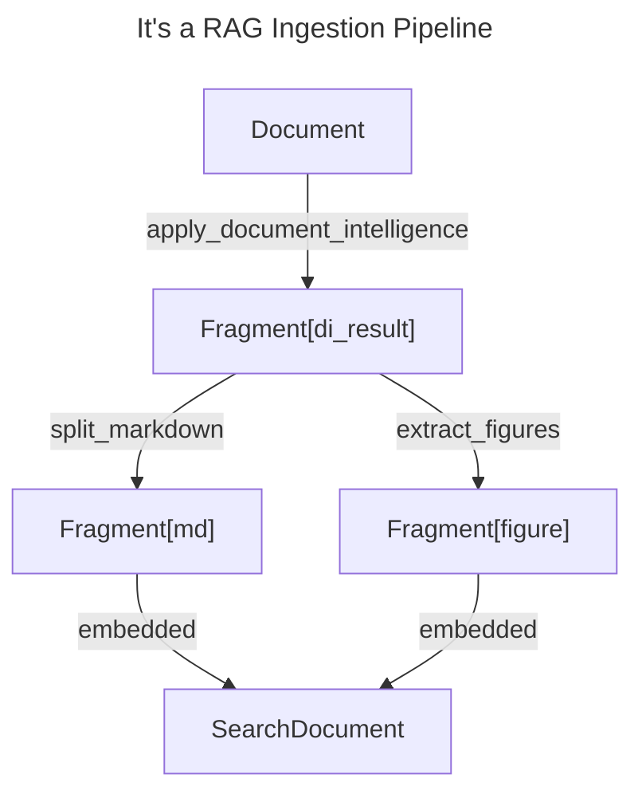

```mermaid
---
title: It's a RAG Ingestion Pipeline
---
flowchart TD
    Fragment_md["Fragment[md]"]
    SearchDocument["SearchDocument"]
    Fragment_di_result["Fragment[di_result]"]
    Fragment_figure["Fragment[figure]"]
    Document -- "apply_document_intelligence" --> Fragment_di_result
    Fragment_di_result -- "extract_figures" --> Fragment_figure
    Fragment_di_result -- "split_markdown" --> Fragment_md
    Fragment_md -- "embedded" --> SearchDocument
    Fragment_figure -- "embedded" --> SearchDocument

```