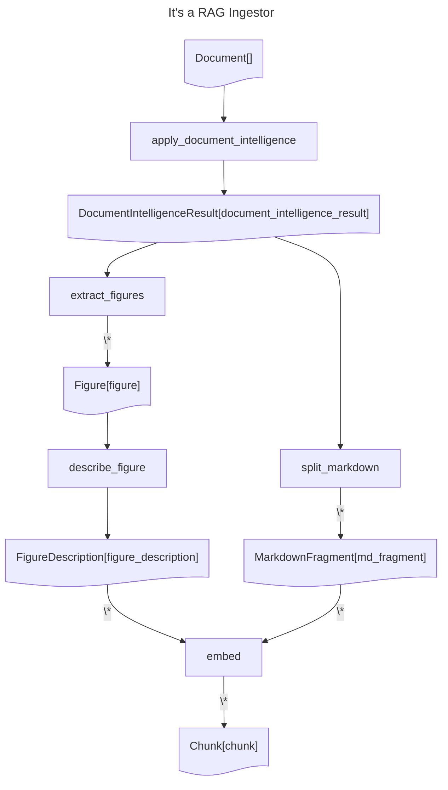

# It's a RAG Ingestor
## Description

"It's a RAG" Catalyst Example: demonstrate how the It's a RAG pattern can be implemented 
with az-ai-catalyst.

Source: https://github.com/francesco-sodano/itsarag

## Diagram

## Operations documentation
### apply_document_intelligence


Get the PDF and apply DocumentIntelligence
Generate a fragment containing DocumentIntelligenceResult and Markdown
<details>
<summary>Code</summary>

```python
@catalyst.operation()
@mlflow.trace(span_type=SpanType.CHAIN)
def apply_document_intelligence(
    document: Document,
) -> Annotated[DocumentIntelligenceResult, "document_intelligence_result"]:
    """
    Get the PDF and apply DocumentIntelligence
    Generate a fragment containing DocumentIntelligenceResult and Markdown
    """

    poller = catalyst.document_intelligence_client.begin_analyze_document(
        model_id="prebuilt-layout",
        body=AnalyzeDocumentRequest(
            bytes_source=catalyst.repository.get(document).content,
        ),
        features=[DocumentAnalysisFeature.OCR_HIGH_RESOLUTION] if document.mime_type == "application/pdf" else [],
        output_content_format=DocumentContentFormat.Markdown,
    )
    return DocumentIntelligenceResult.with_source_result(
        document,
        label="document_intelligence_result",
        analyze_result=poller.result(),
    )

```

</details>

### extract_figures


1. Process every figure in the "document_intelligence_result" fragment, extract the figure from
its bounding box.
2. Create a new image fragment for each figure.
3. Insert a figure reference in the document_intelligence_result fragment Markdown.
<details>
<summary>Code</summary>

```python
@catalyst.operation()
@mlflow.trace(span_type=SpanType.CHAIN)
def extract_figures(
    di_result: DocumentIntelligenceResult,
) -> Annotated[list[Figure], "figure"]:
    """
    1. Process every figure in the "document_intelligence_result" fragment, extract the figure from
    its bounding box.
    2. Create a new image fragment for each figure.
    3. Insert a figure reference in the document_intelligence_result fragment Markdown.
    """
    from az_ai.catalyst.helpers.markdown import MarkdownFigureExtractor

    return MarkdownFigureExtractor().extract(di_result, Figure)

```

</details>

### describe_figure


1. Process the image fragment and generate a description.
2. Create a new fragment with the description.
<details>
<summary>Code</summary>

```python
@catalyst.operation()
@mlflow.trace(span_type=SpanType.CHAIN)
def describe_figure(
    image: ImageFragment,
) -> Annotated[FigureDescription, "figure_description"]:
    """
    1. Process the image fragment and generate a description.
    2. Create a new fragment with the description.
    """
    from az_ai.catalyst.helpers.markdown import extract_code_block

    SYSTEM_CONTEXT = dedent("""\
        You are a helpful assistant that describe images in in vivid, precise details. 

        Focus on the graphs, charts, tables, and any flat images, providing clear descriptions of the data they 
        represent. 

        Specify the type of graphs (e.g., bar, line, pie), their axes, colors used, and any notable trends or patterns. 
        Mention the key figures, values, and labels.

        For each chart, describe how data points change over time or across categories, pointing out any significant 
        peaks, dips, or anomalies. If there are legends, footnotes, or annotations, detail how they contribute to 
        understanding the data.

        **IMPORTANT: Format your response as Markdown.**
    """)

    response = catalyst.azure_openai_client.chat.completions.create(
        model=settings.model_name,
        messages=[
            {"role": "system", "content": SYSTEM_CONTEXT},
            {
                "role": "user",
                "content": [
                    {
                        "type": "text",
                        "text": (
                            "Describe this image.\n"
                            f"**Note**: the image has the following caption:\n {image.metadata['caption']})"
                        )
                        if "caption" in image.metadata
                        else "Describe this image.",
                    },
                    {"type": "image_url", "image_url": {"url": image.content_as_data_url()}},
                ],
            },
        ],
        temperature=settings.temperature,
        max_tokens=settings.max_tokens,
    )

    return FigureDescription.with_source(
        image,
        content=extract_code_block(response.choices[0].message.content)[0],
        mime_type="text/markdown",
        label="figure_description",
        update_metadata={
            "azure_openai_response": response.to_dict(),
            "data_url": image.content_as_data_url(),
        },
    )

```

</details>

### split_markdown


1. Split the Markdown in the "document_intelligence_result" fragment into multiple fragments.
2. Create a new Markdown fragment for each split.
<details>
<summary>Code</summary>

```python
@catalyst.operation()
@mlflow.trace(span_type=SpanType.CHAIN)
def split_markdown(
    document_intelligence_result: DocumentIntelligenceResult,
) -> Annotated[list[MarkdownFragment], "md_fragment"]:
    """
    1. Split the Markdown in the "document_intelligence_result" fragment into multiple fragments.
    2. Create a new Markdown fragment for each split.
    """
    from semantic_text_splitter import MarkdownSplitter

    MAX_CHARACTERS = 2000

    splitter = MarkdownSplitter(MAX_CHARACTERS, trim=False)

    figure_pattern = re.compile(r"<figure>.*?</figure>", re.DOTALL)
    page_break_pattern = re.compile(r"<!-- PageBreak -->")

    fragments = []
    page_nb = 1
    for i, chunk in enumerate(splitter.chunks(document_intelligence_result.content_as_str())):
        content = " ".join(figure_pattern.split(chunk))
        # TODO: this is a bit of a hack
        if page_break_pattern.match(content):
            page_nb += 1
        fragments.append(
            MarkdownFragment.with_source(
                document_intelligence_result,
                label="md_fragment",
                content=content,
                mime_type="text/markdown",
                human_index=i + 1,
                metadata={
                    "file_name": document_intelligence_result.metadata["file_name"],
                    "page_number": page_nb,
                },
            )
        )
    return fragments

```

</details>

### embed


For each figures or MD fragment create an chunk fragment
<details>
<summary>Code</summary>

```python
@catalyst.operation()
@mlflow.trace(span_type=SpanType.CHAIN)
def embed(
    fragments: Annotated[list[Fragment], {"label": ["md_fragment", "figure_description"]}],
) -> Annotated[list[Chunk], "chunk"]:
    """
    For each figures or MD fragment create an chunk fragment
    """
    from az_ai.catalyst.helpers.azure_openai import create_embeddings

    return [
        create_embeddings(
            catalyst=catalyst,
            fragment=fragment,
            label="chunk",
            human_index = index + 1,
            model="text-embedding-3-large",
            metadata={
                "file_name": fragment.metadata["file_name"],
                "page_number": fragment.metadata["page_number"],
                "data_url": fragment.metadata.get("data_url", None),
                "url": f"https://www.example.com/{fragment.metadata['file_name']}",
            }
        )
        for index, fragment in enumerate(fragments)
    ]

```

</details>
