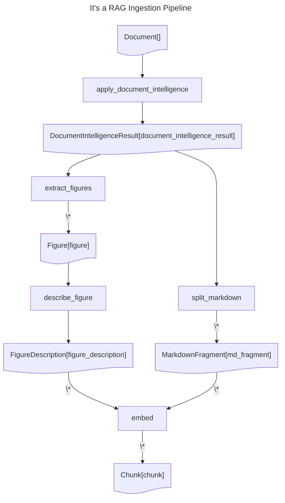

```mermaid
---
title: It's a RAG Ingestion Pipeline
---
flowchart TD
    Document@{ shape: doc, label: "Document[]" }

    apply_document_intelligence@{ shape: rect, label: "apply_document_intelligence" }
    extract_figures@{ shape: rect, label: "extract_figures" }
    describe_figure@{ shape: rect, label: "describe_figure" }
    split_markdown@{ shape: rect, label: "split_markdown" }
    embed@{ shape: rect, label: "embed" }

    DocumentIntelligenceResult_document_intelligence_result@{ shape: doc, label: "DocumentIntelligenceResult[document_intelligence_result]" }
    Figure_figure@{ shape: doc, label: "Figure[figure]" }
    FigureDescription_figure_description@{ shape: doc, label: "FigureDescription[figure_description]" }
    MarkdownFragment_md_fragment@{ shape: doc, label: "MarkdownFragment[md_fragment]" }
    Chunk_chunk@{ shape: doc, label: "Chunk[chunk]" }

    Document --> apply_document_intelligence
    apply_document_intelligence --> DocumentIntelligenceResult_document_intelligence_result

    DocumentIntelligenceResult_document_intelligence_result --> extract_figures
    extract_figures -- \* --> Figure_figure

    Figure_figure --> describe_figure
    describe_figure --> FigureDescription_figure_description

    DocumentIntelligenceResult_document_intelligence_result --> split_markdown
    split_markdown -- \* --> MarkdownFragment_md_fragment

    FigureDescription_figure_description -- \* --> embed
    MarkdownFragment_md_fragment -- \* --> embed
    embed -- \* --> Chunk_chunk

```