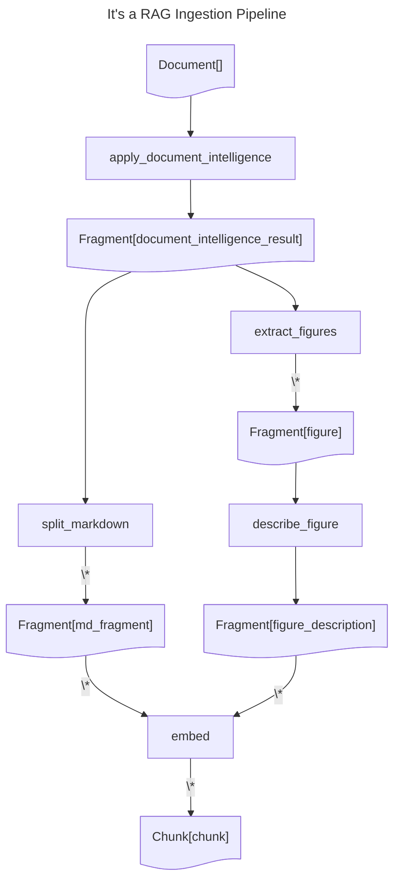

```mermaid
---
title: It's a RAG Ingestion Pipeline
---
flowchart TD
    Document_@{ shape: doc, label: "Document[]" }
    Fragment_document_intelligence_result@{ shape: doc, label: "Fragment[document_intelligence_result]" }
    apply_document_intelligence@{ shape: rect, label: "apply_document_intelligence" }
    Fragment_figure@{ shape: doc, label: "Fragment[figure]" }
    extract_figures@{ shape: rect, label: "extract_figures" }
    Fragment_figure_description@{ shape: doc, label: "Fragment[figure_description]" }
    describe_figure@{ shape: rect, label: "describe_figure" }
    Fragment_md_fragment@{ shape: doc, label: "Fragment[md_fragment]" }
    split_markdown@{ shape: rect, label: "split_markdown" }
    Chunk_chunk@{ shape: doc, label: "Chunk[chunk]" }
    embed@{ shape: rect, label: "embed" }
    Document_ --> apply_document_intelligence
    apply_document_intelligence --> Fragment_document_intelligence_result
    Fragment_document_intelligence_result --> extract_figures
    extract_figures -- \* --> Fragment_figure
    Fragment_figure --> describe_figure
    describe_figure --> Fragment_figure_description
    Fragment_document_intelligence_result --> split_markdown
    split_markdown -- \* --> Fragment_md_fragment
    Fragment_md_fragment -- \* --> embed
    Fragment_figure_description -- \* --> embed
    embed -- \* --> Chunk_chunk
```