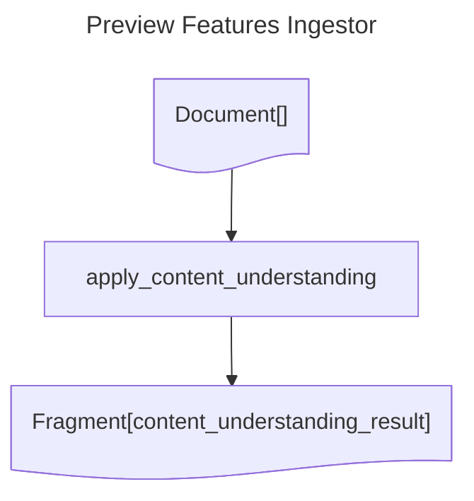

# Preview Features Ingestor
## Diagram

## Operations documentation
### apply_content_understanding


Apply Content Understanding to the document and return a fragment with the result.
<details>
<summary>Code</summary>

```python
@ingestion.operation()
def apply_content_understanding(
    document: Document,
) -> Annotated[Fragment, "content_understanding_result"]:
    """
    Apply Content Understanding to the document and return a fragment with the result.
    """
    ANALYZER_ID = "document-content"
    # See https://learn.microsoft.com/en-us/rest/api/contentunderstanding/analyzers for
    # details about the analyzer template format.
    ANALYZER_TEMPLATE = {
        "description": "Sample document content analyzer",
        "scenario": "document",
        "config": {
            "enableBareCode": True,
            "enableFormula": True,
            "enableLayout": True,
            "enableOcr": True,
            "returnDetails": True,
            # "enableFace": True,
        },
        "fieldSchema": {
            "name": "prescription",
            "description": "Prescription form",
            "fields": {
                "prescription_date": {
                    "type": "date",
                    "method": "extract",
                    "description": "Prescription date",
                },
                "signed_by_dispenser": {
                    "type": "string",
                    "method": "classify",
                    "description": "Is the form signed by the dispenser?",  
                    "enum": [
                        "true",
                        "false",
                    ],
                }

            },
        },
    }

    # Delete the analyzer if it exists and re-created it.
    response = ingestion.content_understanding_client.delete_analyzer(ANALYZER_ID)
    response = ingestion.content_understanding_client.begin_create_analyzer(
        ANALYZER_ID, analyzer_template=ANALYZER_TEMPLATE
    )
    result = ingestion.content_understanding_client.poll_result(response)

    response = ingestion.content_understanding_client.begin_analyze(ANALYZER_ID, file_location=document.content_path())
    result = ingestion.content_understanding_client.poll_result(response)
    content = result["result"]["contents"][0]

    return Fragment.with_source(
        document,
        label="content_understanding_result",
        content=content["markdown"],
        mime_type="text/markdown",
        metadata={
            "prescription_date": content["fields"]["prescription_date"]["valueDate"],
            "signed_by_dispenser": content["fields"]["signed_by_dispenser"]["valueString"] == "true",
            "content_understanding_result": result,
        },
    )

```

</details>
